# React RSSchool 2025 Project

## Для работы приложения необходим либо локальный файл в папке public, либо данные будут получены по url (вероятно понадобится время)

## For the application to work, either a local file in the public folder is required, or the data will be received via url (this will probably take long time)

## Performance Analysis

### Profiling Results

#### Sorting Performance by name

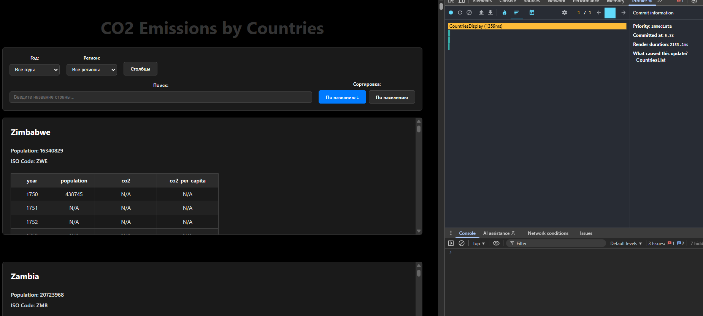
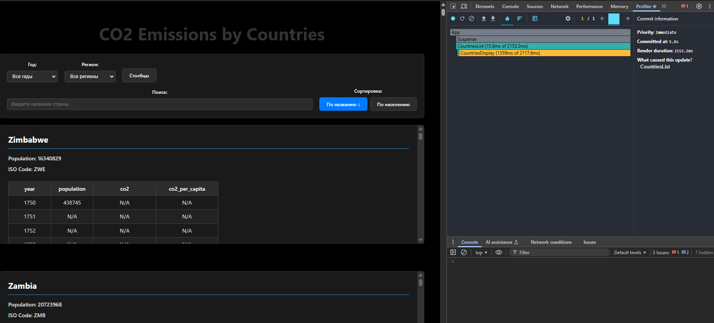

- **Commit Duration**: 5.8s
- **Render Duration**: 2153.2ms
- **Interactions**: Changed sort order by name
- **Components**: CountriesDisplay, DataFilters, CountryList, ColumnSelector

#### Search Performance

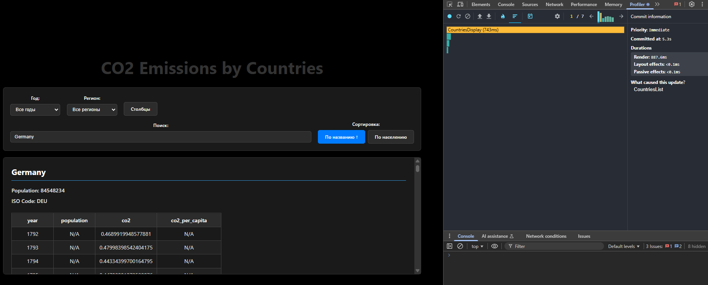
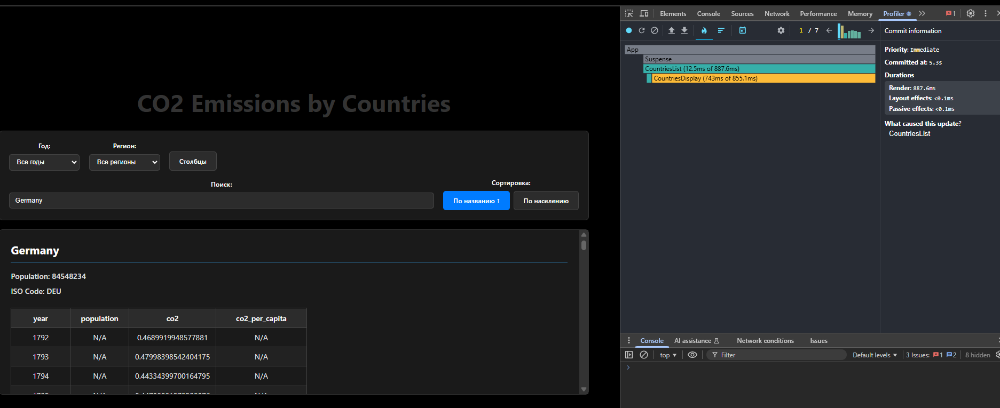

- **Commit Duration**: 5.3s
- **Render Duration**: 887.6ms
- **Interactions**: Searchin Germany country
- **Components**: CountriesList
- **Timeline**: 7 commits, slowest: Step 1

#### Choose another year

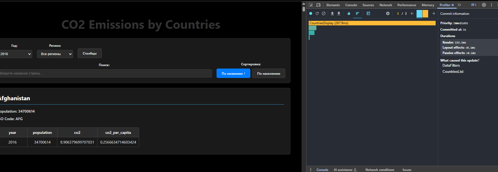
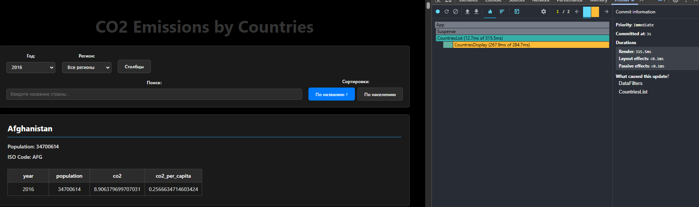
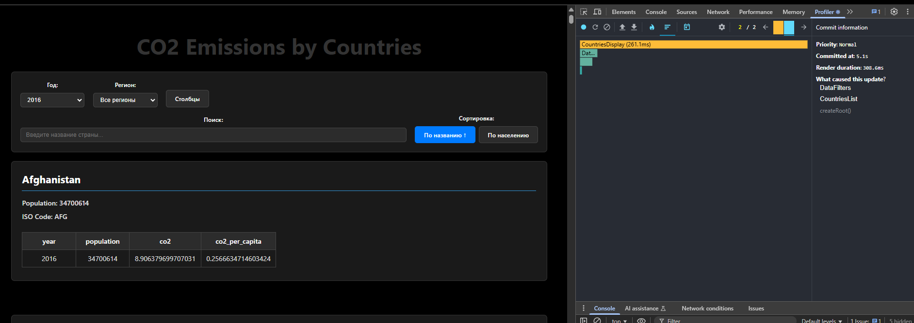
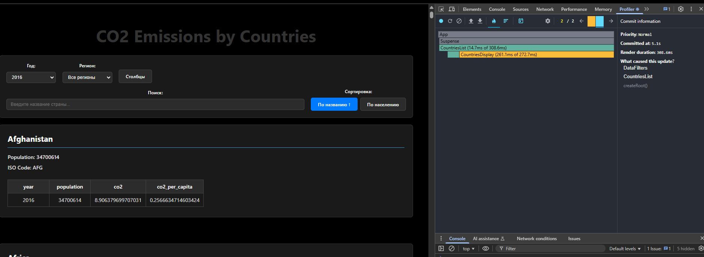

- **Commit Duration**: 3s
- **Render Duration**: 315.5ms
- **Commit Duration-2**: 5.1s
- **Render Duration-2**: 308.6ms
- **Interactions**: Change year
- **Components**: CountriesDisplay, DataFilters, CountryFilters, ColumnSelector
- **Timeline**: 2 commits, slowest: Step 2

#### Adding new Columns

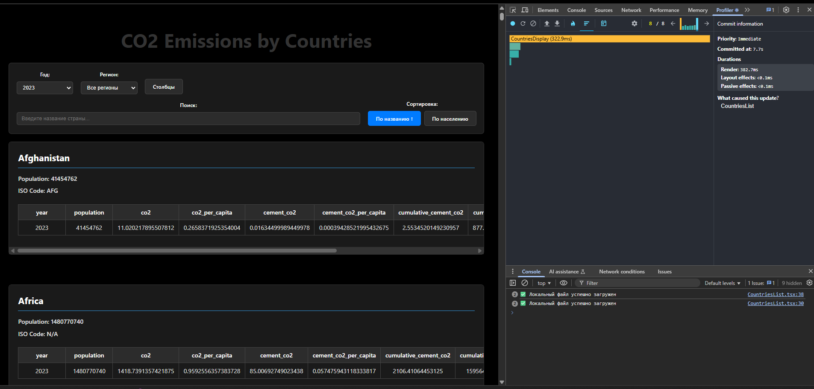
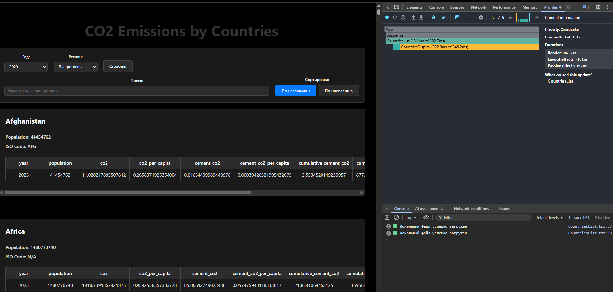

- **Commit Duration**: 7.7s
- **Render Duration**: 382.7ms
- **Interactions**: Adding 6 new columns
- **Components**: CountriesDisplay, CountriesList, DataFilters, ColumnSelector
- **Timeline**: 8 commits, slowest: Step 8

### For all requests:

- **Note**: fetchData called multiple times due to component re-renders

## Results after optimization

#### Sorting Performance by name

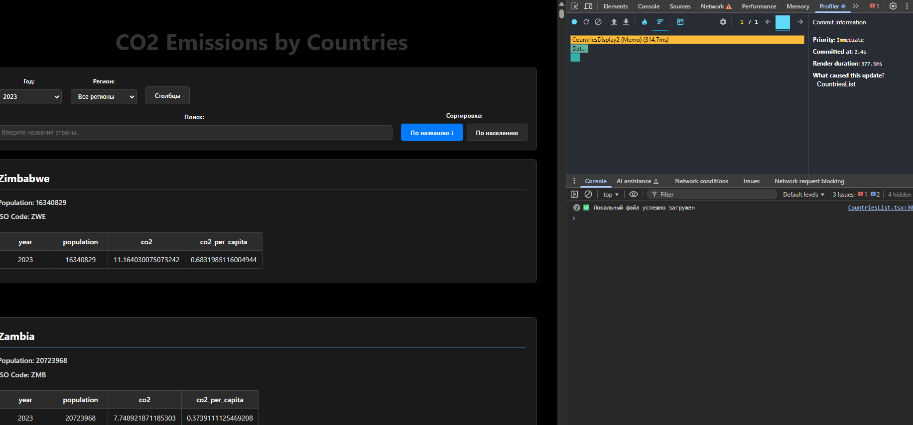
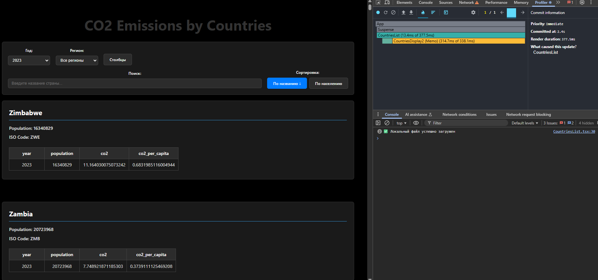

- **Commit Duration**: 2.4s (was 5.8s)
- **Render Duration**: 377.5ms (was 2153.2ms)
- **Interactions**: Changed sort order by name
- **Components**: CountriesDisplay, DataFilters, CountryList, ColumnSelector

#### Search Performance

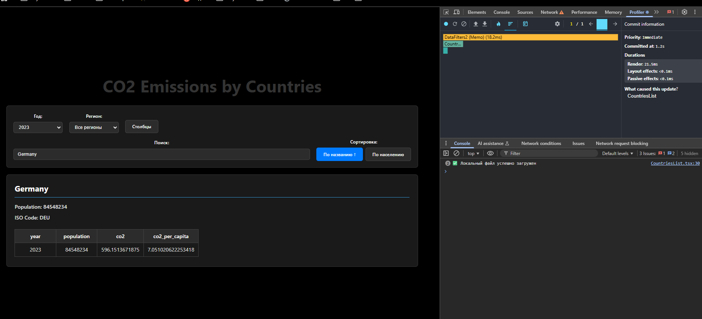
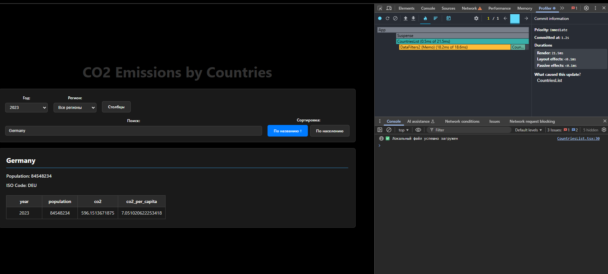

- **Commit Duration**: 1.2s (was 5.3s)
- **Render Duration**: 21.5ms (was 887.6ms)
- **Interactions**: Searchin Germany country
- **Components**: DataFilters, CountriesList, CountriesDisplay
- **Timeline**: 1 commit

#### Choose another year

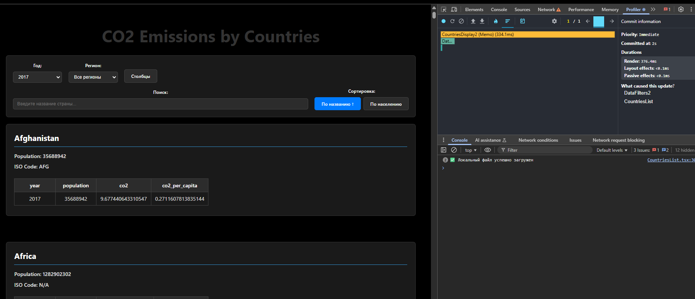
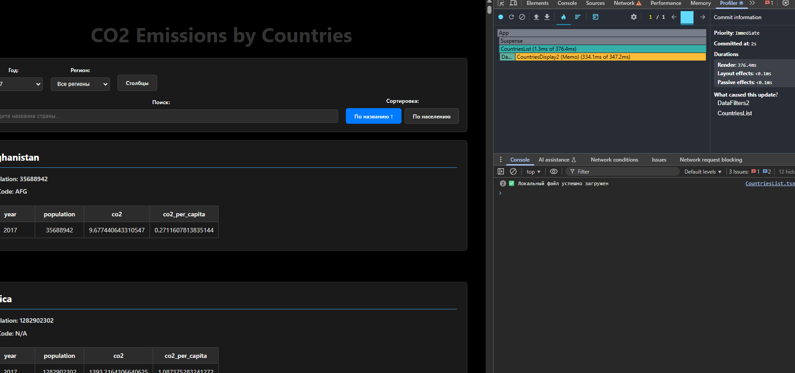

- **Commit Duration**: 2s (was 3s)
- **Render Duration**: 376.4ms (was 315.5ms)
- **Interactions**: Change year
- **Components**: CountriesDisplay, DataFilters, CountryFilters

#### Adding new Columns

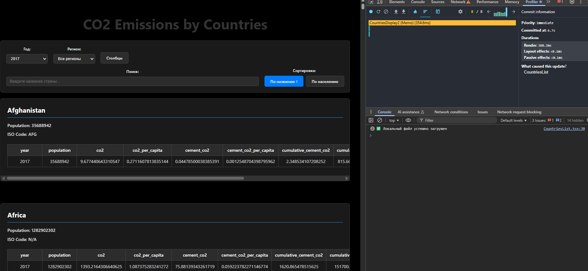
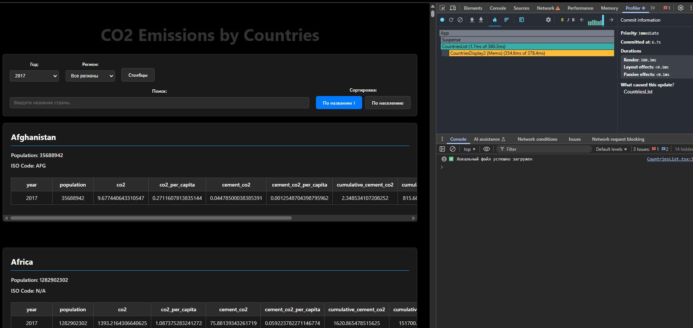

- **Commit Duration**: 6.7s (was 7.7s)
- **Render Duration**: 380.3ms (was 382.7ms)
- **Interactions**: Adding 6 new columns
- **Components**: CountriesDisplay, CountriesList, ColumnSelector
- **Timeline**: 8 commits, slowest: Step 8
